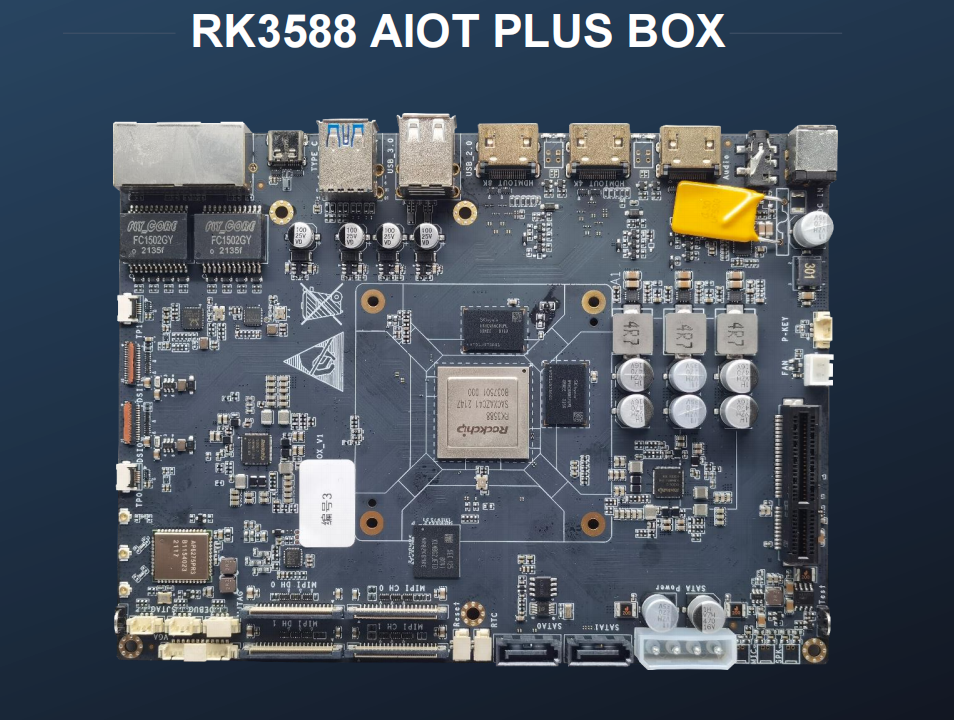
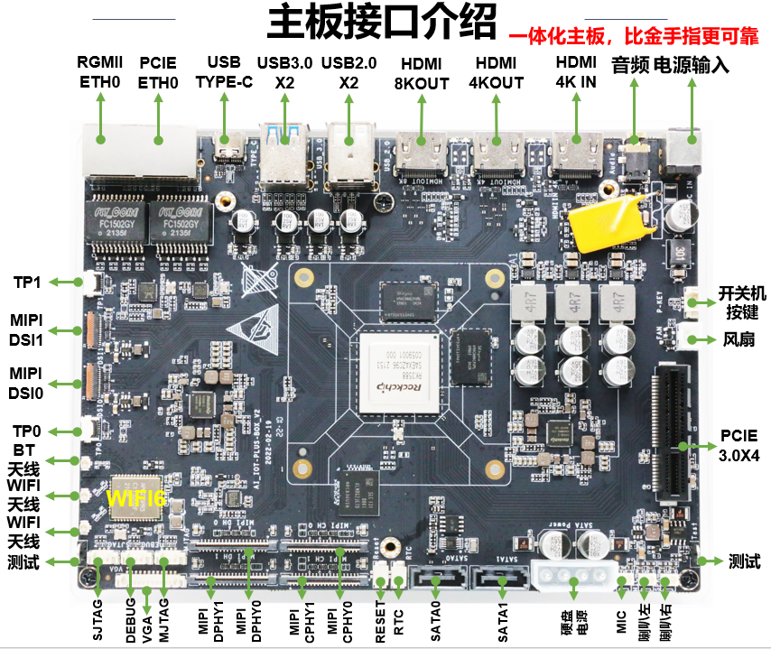
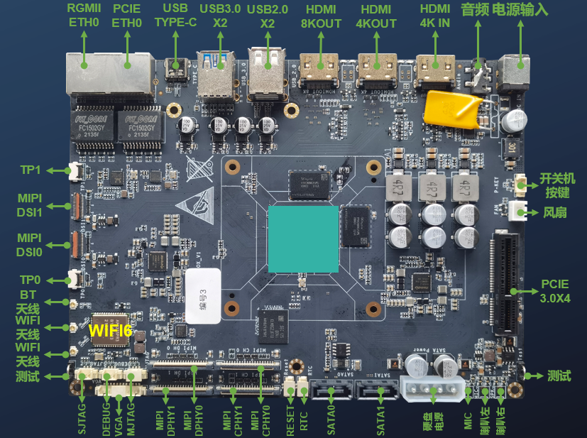

# rk3588-owl-ai-box-plus 猫头鹰微视科技 RK3588开发板

## 目录

* [开发板基本信息](docs/开发板基本信息.md)
* [官方SDK构建](docs/官方SDK构建.md)
* [内核构建](docs/内核构建/内核构建.md)
* [官方文档列表](官方文档列表.md)
* [驱动](docs/驱动.md)
  * [PCIE驱动](docs/驱动/PCIE驱动/PCIE驱动.md)
  * [网卡驱动](docs/驱动/网卡驱动/网卡驱动.md)
  * [WIFI驱动](docs/驱动/WLAN驱动/BCM43752无线网卡驱动.md)
  * [蓝牙驱动](docs/驱动/蓝牙驱动/蓝牙驱动.md)
  * [LED驱动](docs/驱动/LED驱动/LED驱动.md)
  * [USB驱动](docs/驱动/USB驱动/USB驱动.md)
  * [HDMI驱动](docs/驱动/HDMI驱动/HDMI驱动.md)
  * [SATA驱动](docs/驱动/SATA驱动/SATA驱动.md)
  * [音频驱动](docs/驱动/音频驱动/音频驱动.md)
  * [按键驱动](docs/驱动/按键驱动/按键驱动.md)
  * [RTC时钟驱动](docs/驱动/RTC时钟驱动/RTC时钟驱动.md)
  * [风扇驱动](docs/驱动/风扇驱动/风扇驱动.md)
  * [电源驱动](docs/驱动/电源驱动/电源驱动.md)
* [系统](docs/系统.md)
  * [Armbian Debian 13 trixie](docs/系统/armbian/debian13.md)
  * [Armbian Debian 12 bookworm](docs/系统/armbian/debian12.md)
  * [Armbian Debian 11 bullseye](docs/系统/armbian/debian11.md)

## 内核代码仓库

| 内核仓库地址 | 分支 | 内核版本| 状态 | 
| --- | --- | --- | --- | 
| https://github.com/rockchip-linux/kernel | develop-6.1 | 6.1 | 已经引入 |
| https://github.com/rockchip-linux/kernel | develop-6.6 | 6.6 | 已经引入 |
| https://github.com/armbian/linux-rockchip | rk-6.1-rkr5.1 | 6.1 | 已经引入 |
| https://github.com/LubanCat/kernel | lbc-develop-6.1 | 6.1 | 已经引入 |
| https://github.com/friendlyarm/kernel-rockchip | nanopi6-v6.1.y | 6.1 | 已经引入 |
| https://github.com/radxa/kernel | linux-6.1-stan-rkr5.1 | 6.1 | 已经引入 |
| https://github.com/orangepi-xunlong/linux-orangepi | orange-pi-6.1-rk35xx | 6.1 | 已经引入 |

---

