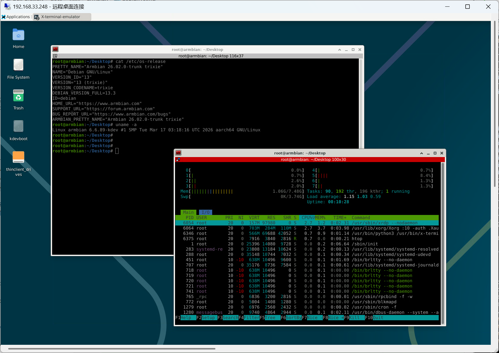
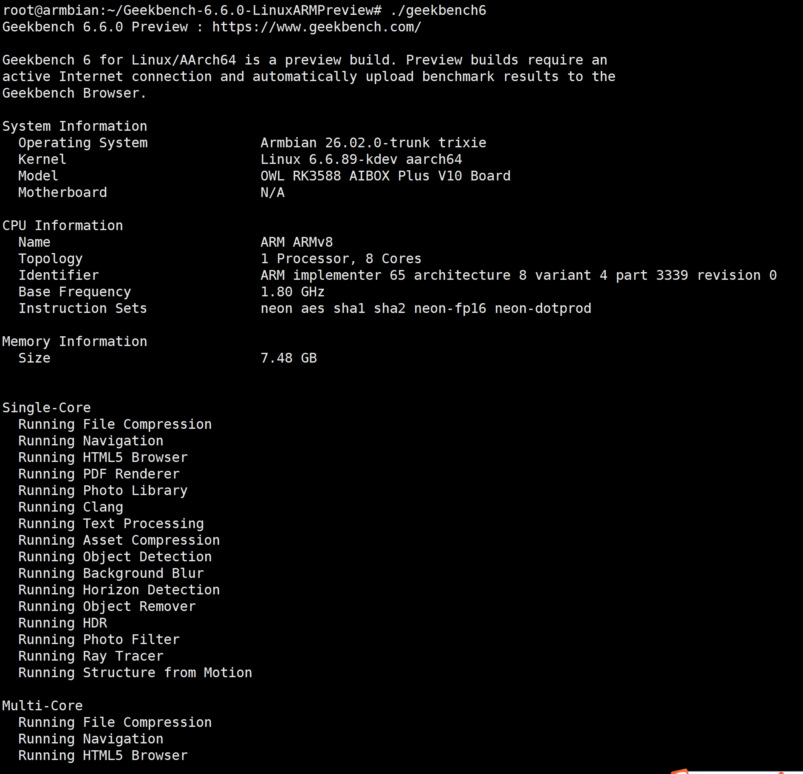
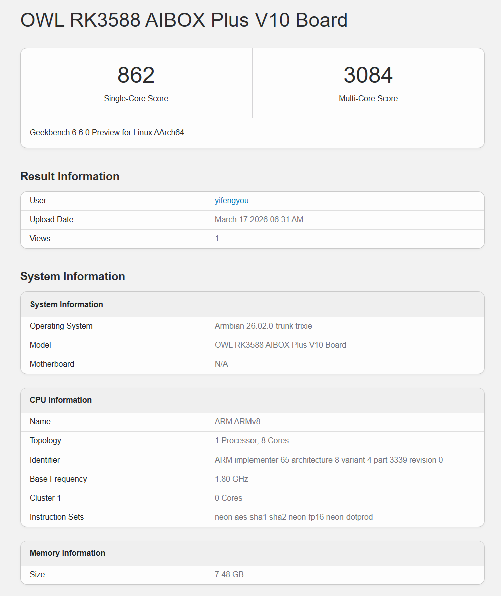
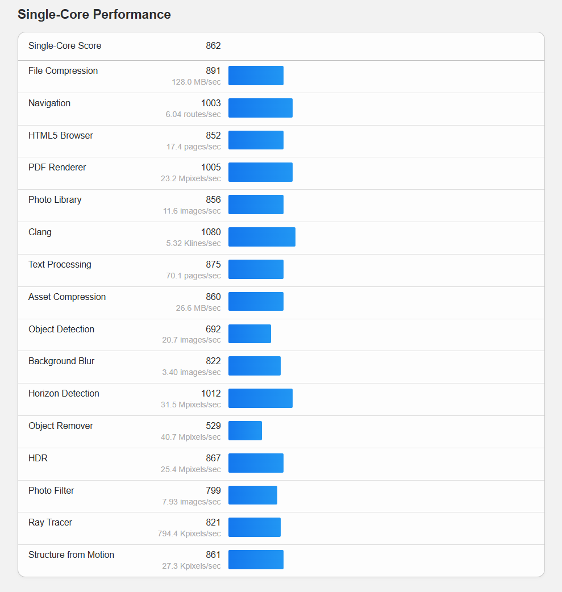
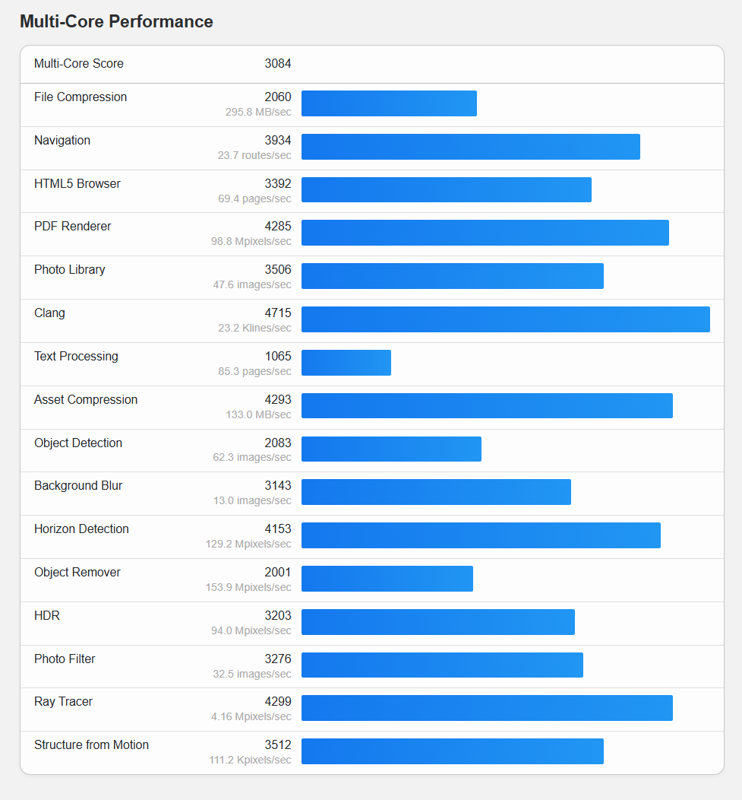

# Armbian Debian 13 trixie

## 基础软件安装


```shell

apt-get update
apt-get install -y vim lrzsz tmux build-essential \
  command-not-found systemd-timesyncd lm-sensors net-tools \
  apt-file

ssh-keygen -t rsa
```


## xrdp远程桌面

```shell
apt-get install -y xorgxrdp xrdp 

```




## 安装docker


```shell

curl -fsSL https://get.docker.com -o get-docker.sh
bash get-docker.sh

docker run hello-world
docker run -it --rm debian:12 /bin/bash


systemctl status docker

docker ps

```


## 安装kvm虚拟机


```shell

# 安装virsh、qemu依赖
apt install -y qemu-kvm libvirt-daemon-system \
  libvirt-clients bridge-utils virtinst \
  qemu-efi-aarch64 ovmf qemu-utils ipxe-qemu

# 创建虚拟机测试
virsh net-start default
cd /tmp/
qemu-img create -f qcow2 rootfs.qcow2 500G
touch /tmp/123.iso
virt-install \
  --name vm \
  --memory 2048 \
  --vcpus 2 \
  --disk path=rootfs.qcow2,size=20,format=qcow2,bus=virtio \
  --cdrom /tmp/123.iso \
  --osinfo generic \
  --graphics none \
  --console pty,target_type=serial \
  --accelerate

```


## geekbench跑分测试


```shell

wget -c https://cdn.geekbench.com/Geekbench-6.6.0-LinuxARMPreview.tar.gz
tar -xvf Geekbench-6.6.0-LinuxARMPreview.tar.gz
cd Geekbench-6.6.0-LinuxARMPreview
./geekbench6

```











---


