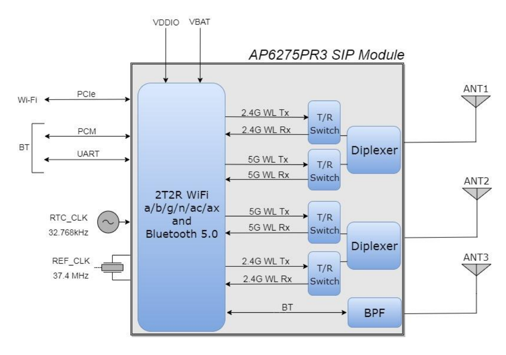
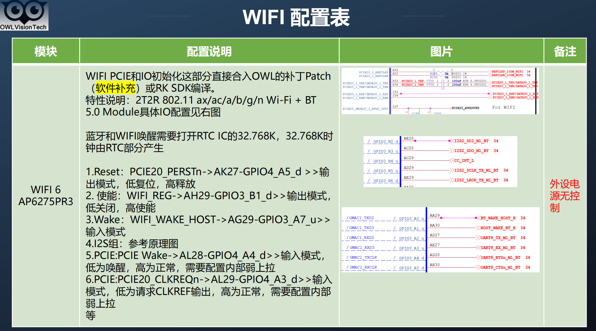
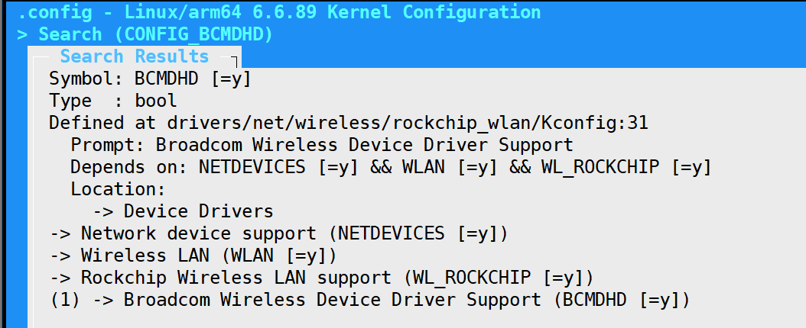
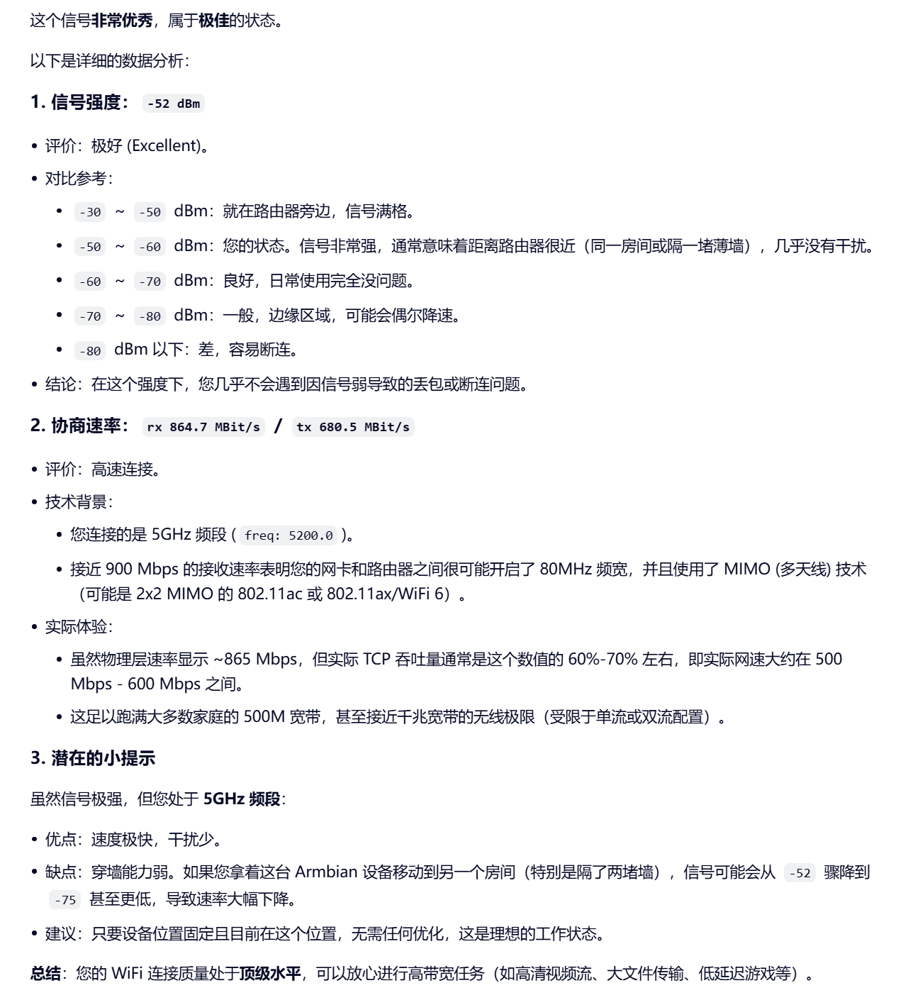
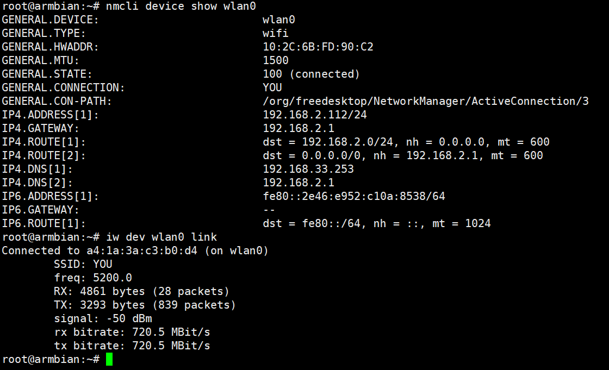

# AP6275PR3 - Broadcom BCM43752无线网卡驱动


**板子上的芯片是 AP6275PR3**



AP6275PR3 是一个 WiFi + 蓝牙的二合一组合模块（基于 Broadcom BCM43752 芯片方案），其内部两个功能单元使用不同的总线与主机（SoC）通信：
WiFi 部分：走 PCIe 接口（这也是型号中 R 通常代表的含义，区别于走 SDIO 接口的 S 系列）。
对应您的日志：dmesg 中出现的 dhd (Broadcom WiFi驱动) 和 pcie 相关日志，以及高速率 (864.7 MBit/s) 都证实了 WiFi 正在通过 PCIe 正常工作。
蓝牙部分：走 UART 接口（通常支持高速 UART，如 3Mbps 或更高），部分场景下音频数据可走 PCM/I2S 接口。
对应您的日志：dmesg 中加载了 HCI UART driver 和 ATH3K 协议栈，说明系统已经准备好通过 UART 来驱动蓝牙，但尚未成功建立连接。




AP6275系列是采用28纳米工艺的BCM43752方案设计、封装15x13mm/LGA-50，有SDIO接口和PCIe接口可选，同时还有蓝牙和WiFi天线是否共用区分；具体如下：

AP6275S通信接口SDIO3.0@WiFi/UART@BT5.3；吞吐量TX>450Mbps、RX>550Mbps；蓝牙和WIFI共用天线。
AP6275P通信接口PCIE@WiFi/UART@BT5.3；吞吐量TX>750Mbps、RX>810Mbps；蓝牙和WIFI共用天线。
AP6275PR3通信接口PCIE@WiFi/UART@BT5.3；吞吐量TX>750Mbps、RX>810Mbps；蓝牙和WIFI独立天线。

基于PCIE接口通信模块有扩展直接的标准网卡AP12275_M2P和AP12275_M2

这个系列模块主要特性如下：多连接，采用OFDMA编码；调制采用QAM1024，吞吐量大；采用TWT，目标唤醒时间，低功耗；支持RX DL MU-MIMO；BT power 13dB，支持LE AUDIO。同样BCM43752方案的兼容模块型号还有AP6398SV、AP6398SV和WIFI6E模块AP6276S、AP6276P、AP6276PR3。

总之一句话：支持IEEE 802.11ax/ac/a/b/g/n标准的方案BCM43752可以有丰富多样的WIFI6/WIFI6模块供选择


Broadcom BCM43752 (PCI ID: 14e4:449d) 在 Linux 6.6 内核 下的驱动适配，情况如下：

* BCM43752 是一款较新的 Wi-Fi 6E/7 级别芯片（通常用于高端笔记本或嵌入式设备），目前 Linux 主线内核（包括 6.6）尚未完全原生支持 该特定型号。
* 驱动模块：该芯片理论上应使用 brcmfmac 驱动（Broadcom FullMAC 驱动），这是内核中处理现代 Broadcom PCIe/SDIO 无线网卡的标准开源驱动。
* 现状：虽然 brcmfmac 驱动在 6.6 内核中已存在，但它可能缺少针对 449d 这个特定 Device ID 的识别条目，或者最关键的——缺少对应的固件文件。


```c

root@armbian:~# lspci -nn
0002:20:00.0 PCI bridge [0604]: Rockchip Electronics Co., Ltd RK3588 [1d87:3588] (rev 01)
0002:21:00.0 Network controller [0280]: Broadcom Inc. and subsidiaries BCM43752 802.11ax Dual Band Wireless LAN Controller [14e4:449d] (rev 02)
0003:30:00.0 PCI bridge [0604]: Rockchip Electronics Co., Ltd RK3588 [1d87:3588] (rev 01)
0003:31:00.0 Ethernet controller [0200]: Realtek Semiconductor Co., Ltd. RTL8111/8168/8211/8411 PCI Express Gigabit Ethernet Controller [10ec:8168] (rev 15)
root@armbian:~# 


```


0002:21:00.0 Network controller [0280]: Broadcom Inc. and subsidiaries BCM43752 802.11ax Dual Band Wireless LAN Controller [14e4:449d] (rev 02)


定义于：

```c
drivers/net/wireless/rockchip_wlan/rkwifi/bcmdhd/include/bcmdevs.h
150:#define BCM43752_D11AX_ID	0x449d		/* 43752 802.11ax dualband device */
```

驱动在：

```c
drivers/net/wireless/rockchip_wlan/rkwifi/bcmdhd/dhd_pcie.c
14865:		case BCM43752_D11AX_ID:
```





## wifi信号

```shell
root@armbian:~# iw dev wlan0 link
Connected to a4:1a:3a:c3:b0:d4 (on wlan0)
	SSID: YOU
	freq: 5200.0
	RX: 21577 bytes (100 packets)
	TX: 5106 bytes (680 packets)
	signal: -52 dBm
	rx bitrate: 864.7 MBit/s
	tx bitrate: 680.5 MBit/s
root@armbian:~# 
```

信号质量：






## 常用wifi命令

### 1. 扫描与发现
- `nmcli radio wifi on` # 开启 Wi-Fi 无线电开关
- `nmcli radio wifi off` # 关闭 Wi-Fi 无线电开关
- `nmcli device wifi rescan` # 强制重新扫描周围热点
- `nmcli device wifi list` # 列出附近可用的 Wi-Fi 信号列表 (含信号强度、加密方式)

### 2. 连接操作
- `nmcli device wifi connect "SSID名称" password "密码"` # 连接指定 Wi-Fi 并自动保存配置
- `nmcli device wifi connect "SSID名称" password "密码" hidden yes` # 连接隐藏的 Wi-Fi 热点
- `nmcli device wifi connect "SSID名称" password "密码" ifname wlan0` # 指定网卡接口进行连接
- `nmcli connection up "连接名称"` # 激活已保存的某个网络连接配置
- `nmcli connection down "连接名称"` # 断开当前已激活的连接配置

### 3. 状态查看与管理
- `nmcli device status` # 查看所有网络设备状态 (eth0, wlan0 等)
- `nmcli connection show` # 列出所有已保存的网络配置文件 (UUID, 类型, 设备)
- `nmcli connection show "连接名称"` # 查看特定连接的详细配置 (IP, DNS, 网关等)
- `nmcli device show wlan0` # 查看 wlan0 接口的详细实时状态
- `nmcli connection delete "连接名称"` # 删除已保存的某个网络配置 (不再自动连接)

### 4. 故障排查
- `rfkill list` # 查看无线网卡是否被硬件或软件锁定 (blocked)
- `rfkill unblock wifi` # 解除 Wi-Fi 的软件锁定
- `nmcli general logging level DEBUG` # 临时开启 NetworkManager 调试日志
- `journalctl -u NetworkManager -f` # 实时查看 NetworkManager 服务运行日志

## 参考

* [AMPAK-Tech AP6275PR3 (Wi-Fi and Bluetooth module) datasheet](https://datasheet.lcsc.com/lcsc/2203311530_AMPAK-Tech-AP6275PR3_C2984106.pdf)


---