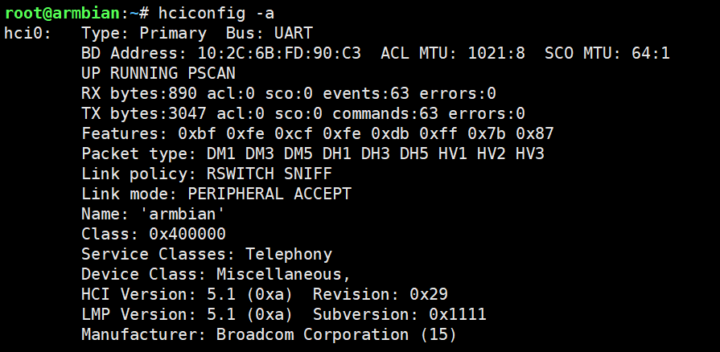
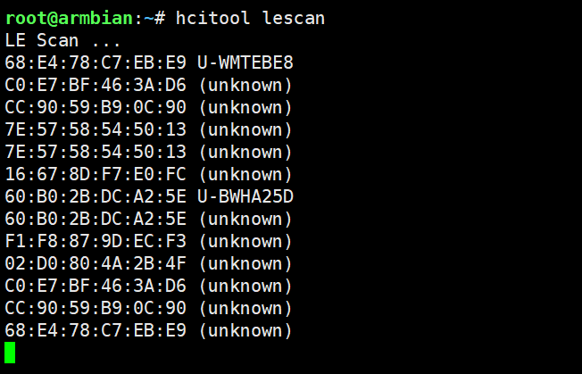
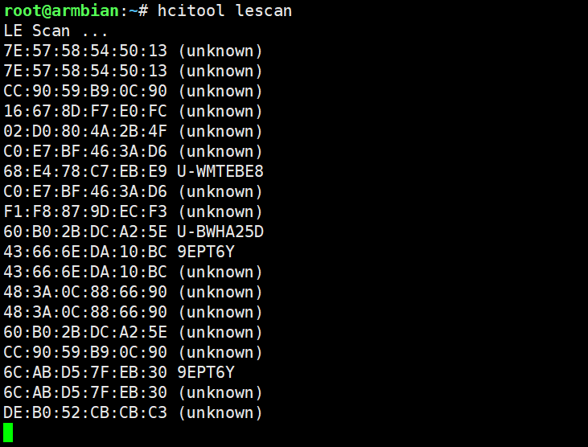
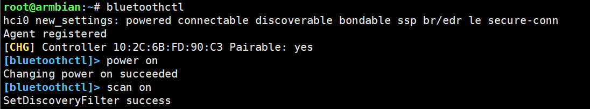

# 蓝牙驱动


**板子上的芯片是 AP6275PR3**


## 使用方式

### 运行brcm_patchram_plus


运行于后台，会有大量日志输出

```shell

brcm_patchram_plus -d --enable_hci --no2bytes --tosleep 200000 --baudrate 1500000 --patchram /lib/firmware/BCM4362A2.hcd /dev/ttyS8 
```

### hciconfig方式（deprecated）

```shell

# 查看所有蓝牙适配器状态
hciconfig -a

# 如果显示 DOWN，需要启用它 (假设适配器名为 hci0)
hciconfig hci0 up

# 设置适配器可见性 (可选)
hciconfig hci0 piscan

# 扫描周围的蓝牙设备 (显示 MAC 地址和设备名称)
hcitool scan

# 仅获取 MAC 地址 (速度稍快)
hcitool lescan  # 针对低功耗蓝牙 (BLE)

# 尝试连接 (这通常只是建立链路层连接，不一定能传输数据)
hcitool cc <MAC_ADDRESS>

# 绑定设备到 /dev/rfcomm0
rfcomm bind /dev/rfcomm0 <MAC_ADDRESS> 1

# 现在可以通过串口工具连接
screen /dev/rfcomm0 9600
# 或者
cat < /dev/rfcomm0

```









### bluetoothctl


```shell
进入交互模式

bluetoothctl
进入后提示符变为 [bluetooth]#。


# 开启扫描
scan on

# 等待几秒，看到目标设备后，记下 MAC 地址，然后关闭扫描以节省资源
scan off

# 配对 (如果是首次连接)
pair AA:BB:CC:DD:EE:FF

# 连接
connect AA:BB:CC:DD:EE:FF

# 信任设备 (以便下次自动连接)
trust AA:BB:CC:DD:EE:FF

# 列出所有已知的设备及其连接状态
devices

# 查看特定设备的详细信息 (包括 Connected: yes/no)
info AA:BB:CC:DD:EE:FF

```




## 参考

